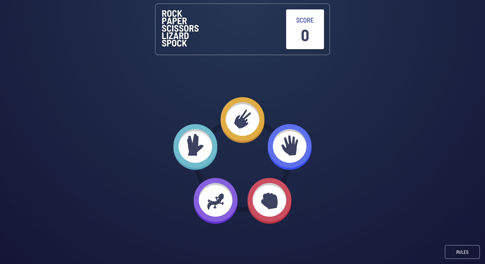
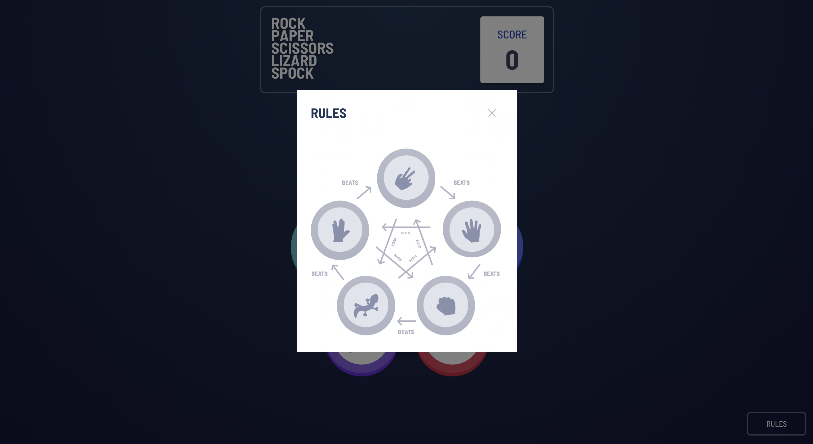
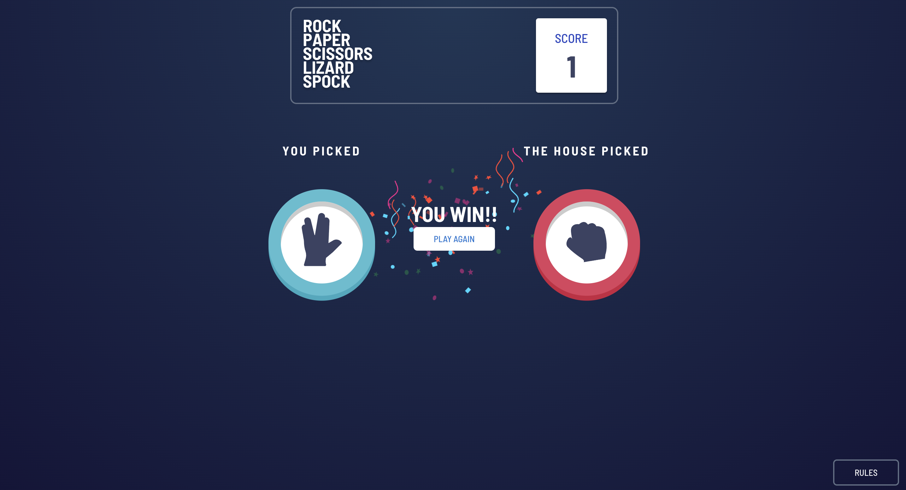
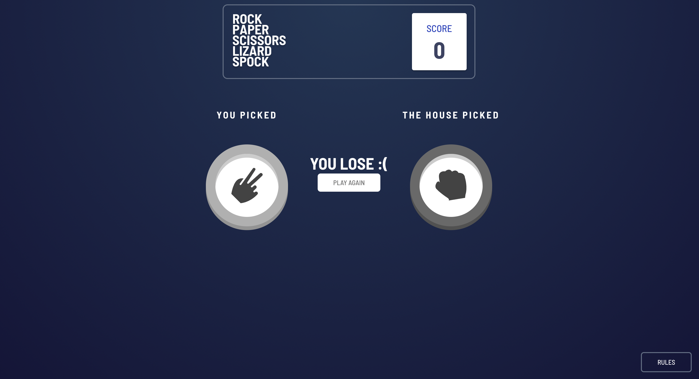
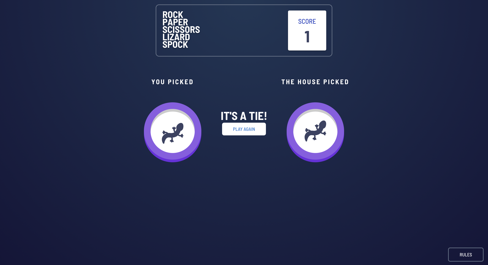

# Frontend Mentor - Rock, Paper, Scissors solution

This is a solution to the [Rock, Paper, Scissors challenge on Frontend Mentor](https://www.frontendmentor.io/challenges/rock-paper-scissors-game-pTgwgvgH). Frontend Mentor challenges help you improve your coding skills by building realistic projects.

## Table of contents

- [Overview](#overview)
  - [The challenge](#the-challenge)
  - [Screenshots](#screenshots)
  - [Links](#links)
- [My process](#my-process)
  - [Built with](#built-with)
- [Author](#author)

## Overview

### The challenge

Users should be able to:

- View the optimal layout for the game depending on their device's screen size
- Play Rock, Paper, Scissors against the computer
- Maintain the state of the score after refreshing the browser _(optional)_
- **Bonus**: Play Rock, Paper, Scissors, Lizard, Spock against the computer _(optional)_

### Screenshots

### Links

- Solution URL: [https://github.com/davidivad96/rock-paper-scissors-lizard-spock](https://github.com/davidivad96/rock-paper-scissors-lizard-spock)
- Live Site URL: [https://epic-rpsls.netlify.app/](https://epic-rpsls.netlify.app/)
- Post on my Hashnode blog: [https://davidivad96.hashnode.dev/how-i-built-and-deploy-a-rock-paper-scissors-lizard-spock-web-app](https://davidivad96.hashnode.dev/how-i-built-and-deploy-a-rock-paper-scissors-lizard-spock-web-app)

## My process

### Built with

- [React](https://reactjs.org/)
- [MaterialUI](https://mui.com/)
- [LottieFiles](https://lottiefiles.com/)
- [Netlify](https://www.netlify.com/)

## Author

- GitHub - [davidivad96](https://github.com/davidivad96)
- Frontend Mentor - [@davidivadf96](https://www.frontendmentor.io/profile/davidivad96)
- LinkedIn - [David Fernández Ortiz](https://www.linkedin.com/in/david-fernandez-ortiz/)
